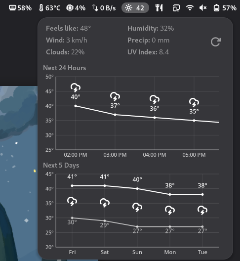

# GNOME Shell Extension - OpenMeteo Weather
### Fork of the [Weather or Not](https://github.com/somepaulo/GNOME-Shell-extension-Weather-or-Not) extension that uses Open-meteo API

A simple extension for GNOME Shell 45+ that adds an icon showing the current weather conditions and temperature to the panel. The indicator position can be adjusted in preferences.

______

## Installation

Alternatively, use the [Extension Manager](https://github.com/mjakeman/extension-manager) app.

#### Manual installation
1. Make sure you have GNOME Weather installed and a default location set in it
2. Download the [openmeteoweather@deezhizyu.github.io.zip](https://github.com/deezhizyu/gnome-shell-openmeteoweather-extension/releases/latest/download/openmeteoweather@deezhizyu.github.io.zip) archive from releases and unzip it
3. Copy the `openmeteoweather@deezhizyu.github.io` folder to `~/.local/share/gnome-shell/extensions/`
4. Log out and log back in (on Wayland) or use `Alt+F2`,`r`,`Enter` (on X11)
5. Enable the extension in either `Extensions`, `Extension Manager` or [GNOME Shell Extensions](https://extensions.gnome.org/local/)

#### Credits
- [Weather or Not](https://github.com/somepaulo/GNOME-Shell-extension-Weather-or-Not)
- [Open-meteo API](https://open-meteo.com/)
- Gnome extension build workflow from [Vitals](https://github.com/corecoding/Vitals)
